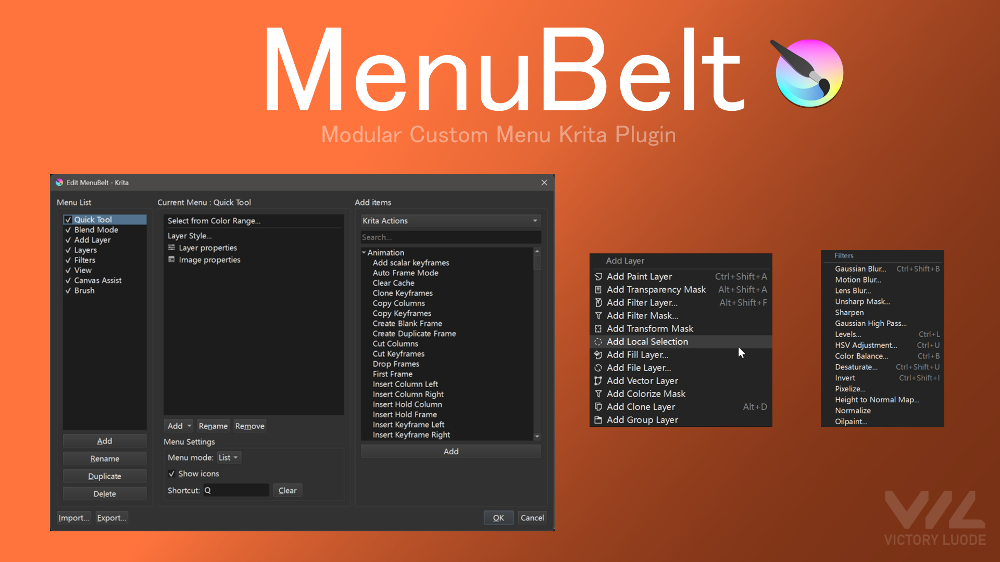

Build your own **multi-list action menus** in Krita and reach them from a **cursor popup**
or the **Tools → MenuBelt** submenu — as a **linear List** or a **Blender-style radial Pie**.

## Demo

<video src="https://raw.githubusercontent.com/VictoryLuode/MenuBelt/main/assets/menubelt-demo.mp4" poster="https://raw.githubusercontent.com/VictoryLuode/MenuBelt/main/assets/menubelt-poster.png" controls></video>

Or watch on [YouTube](https://youtu.be/hjSDBv3bs3Q).

## Highlights

- **Native Krita actions** — icons, state and shortcut hints inherited automatically.
- **Eight "Add" sources** — Krita Actions, Layer & Brush Blend Modes, Brush Values, Colour swatches, Brushes, **Scripts** and **View Mode**.
- **Script library** — write, edit, rename and run your own Python from a menu item; scripts live as plain `.py` files next to the plugin.
- **View modes** — toggle a non-destructive display mode (e.g. *Luminosity (ITU-R BT.709)*) as a filter layer, never by painting into your layers.
- **List or Pie** — linear menus, or a radial pie (up to 8 items).
- **Nested menus** — submenus, headers, separators and checkable toggles.
- **Per-list shortcuts** — bind hotkeys in-editor, no Krita shortcut dialog needed.
- **Shortcut takeover** — a key that is already taken can be overridden: the other binding is unbound automatically, and for a Krita action that removal survives a restart.
- **Live preview · Export / Import · conflict detection.**

## Install

> **Requires Krita 5.x** (developed against 5.3).

**OS support:**

- [x] Windows (10, 11)
- [x] Linux
- [ ] macOS (untested)
- [ ] Android (no Python plugins yet)

1. Download the latest `menubelt.zip` from [Releases](../../releases).
2. Unzip and copy the `pykrita/` and `actions/` folders into your Krita resource dir
   (Windows `%APPDATA%/krita/`, Linux `~/.config/krita/`).
3. Restart Krita, then enable it in **Settings → Configure Krita → Python Plugin Manager**.

## Quick start

**Tools → MenuBelt → Configure MenuBelt**, pick a list, add items from a source
(Krita Actions, Blend Modes, Brush Values, Palettes, Brushes, Scripts, View Mode) or **Add Submenu /
Header / Separator / Toggle**, then **drag to reorder** and **double-click** to rename.

Bind a list shortcut by clicking its *Shortcut* field; the whole-menu trigger lives in
**Keyboard Shortcuts → MenuBelt → Pop Up Custom List**.

## Community

- [Report a bug](../../issues)
- [Latest release](../../releases)
- [Krita Artists forum](https://krita-artists.org/t/menubelt-build-your-own-multi-list-action-menus-list-pie/190122)

## License

[GPL-3.0](LICENSE).
